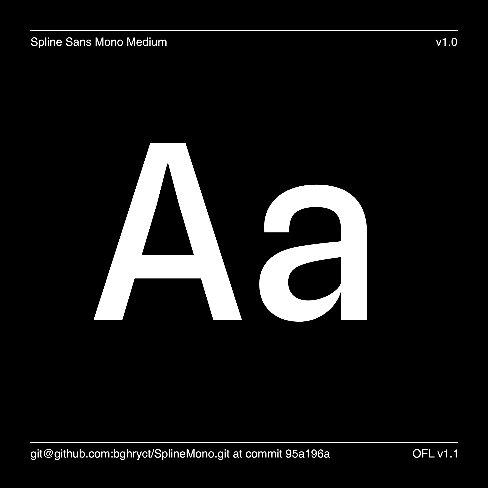

Spline Sans Mono by Sorkin Type
===========================

[![][Fontbakery]](https://bghryct.github.io/SplineMono/fontbakery/fontbakery-report.html)
[![][Universal]](https://bghryct.github.io/SplineMono/fontbakery/fontbakery-report.html)
[![][GF Profile]](https://bghryct.github.io/SplineMono/fontbakery/fontbakery-report.html)
[![][Outline Correctness]](https://bghryct.github.io/SplineMono/fontbakery/fontbakery-report.html)
[![][Shaping]](https://bghryct.github.io/SplineMono/fontbakery/fontbakery-report.html)

[Fontbakery]: https://img.shields.io/endpoint?url=https%3A%2F%2Fraw.githubusercontent.com%2Fbghryct%2FSplineMono%2Fgh-pages%2Fbadges%2Foverall.json
[GF Profile]: https://img.shields.io/endpoint?url=https%3A%2F%2Fraw.githubusercontent.com%2Fbghryct%2FSplineMono%2Fgh-pages%2Fbadges%2FGoogleFonts.json
[Outline Correctness]: https://img.shields.io/endpoint?url=https%3A%2F%2Fraw.githubusercontent.com%2Fbghryct%2FSplineMono%2Fgh-pages%2Fbadges%2FOutlineCorrectnessChecks.json
[Shaping]: https://img.shields.io/endpoint?url=https%3A%2F%2Fraw.githubusercontent.com%2Fbghryct%2FSplineMono%2Fgh-pages%2Fbadges%2FShapingChecks.json
[Universal]: https://img.shields.io/endpoint?url=https%3A%2F%2Fraw.githubusercontent.com%2Fbghryct%2FSplineMono%2Fgh-pages%2Fbadges%2FUniversal.json


Spline Sans Mono is a Monospaced Grotesque purpose-built for UI interfaces, checkout processes, and programming. Space efficiency is accomplished by condensing traditional grotesque proportions. The cool and restrained tone is accented with strategic "thorn" traps, which blossom into view when set at larger sizes.

Spline Sans Mono is an original typeface initiated by the <a href="https://spline.design/">Spline Team</a> and designed by Eben Sorkin and Mirko Velimirovic.
Project manager - Faride Mereb. Testing and design feedback - Gonçalo Teixeira. Concept - Alejandro León.

Spline Sans Mono supports Google Core, Google Plus, Google Pro, Plus Optional, and Pro optional glyph sets, enabling the typesetting of English, and Western European languages.




License
-------

Spline Sans is available under the SIL Open Font License v1.1, for more details see [OFL.txt](OFL.txt).

Contributions
-------------


To contribute ideas and feedback, see [https://github.com/SorkinType/SplineSans](https://github.com/SorkinType/SplineSans)


Source Files - Glyphs app file
------------

```
└── sources
    ├── SplineSansMono.glyphs	# Contains all data to build the font


```

Build Instructions 
------------------

To build the font use Glyphs App and export TTF, OTF or other supported file formats.

or if you do not have a copy of Glyphs please do the following.
Open terminal (if using macos)

`$ python3 -m venv venv`
Sets up a python virtual environment

`$ source venv/bin/activate`
Turns on your virtual environment

`$ pip install --upgrade pip`
upgrades pip

`$ pip install gftools`
gives you the tools you will need to build the project

then from the root of the repo 
`$ gftools build-vf --fixnonhinting --static`

## Repository Layout

This font repository structure is inspired by [Unified Font Repository v0.3](https://github.com/unified-font-repository/Unified-Font-Repository), modified for the Google Fonts workflow.
